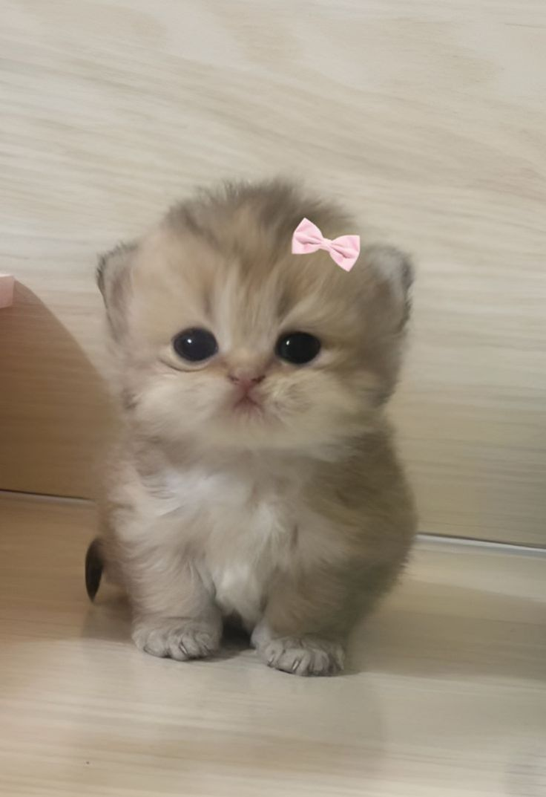

# 😺 Cat Code - Valentine's Interactive Experience

<div align="center">
  
  <br>
  <em>A playful Valentine's themed web application with irresistible cat charm</em>
</div>

## ✨ Features

- 💕 Interactive "Yes/No" Valentine's proposal (spoiler: it always ends with "Yes")
- 🐱 Adorable cat-themed visuals throughout the experience
- 🚀 Smooth transitions between multiple interactive screens
- 🔊 "Meow" button that fills your screen with cute cat images
- 🧹 Easy clean-up with the "Clear" button
- 📱 Responsive pink-themed design for any device

## 🛠️ Technologies


## 📷 Preview

<div align="center">
  <p>The application features multiple interactive screens with playful cat imagery and Valentine's themed elements.</p>
</div>

## 🚀 Getting Started

1. Clone this repository
   ```bash
   git clone https://github.com/YOUR-USERNAME/catcode.git
   cd catcode
   ```
2. Open `index.html` in your web browser
3. Enjoy the Valentine's experience!

## 🎮 How to Use

1. When asked "Wanna Enter In My Heart?", try clicking "Yes" or hovering over "No"
2. Explore the subsequent screens and interactions
3. Click the "Meow" button to add adorable cat images
4. Use the "Clear" button when you want to start fresh

## 📁 Project Structure

```
catcode/
├── index.html            # Main entry page with Valentine's proposal
├── next-page.html        # Secondary experience page
├── style.css             # Main stylesheet
├── next-page-style.css   # Styles for secondary page
├── script.js             # Interactive functionality
└── images/               
    ├── cat.jpg           # Various cat images used throughout
    ├── download.jpg
    ├── hugging-cats.jpg.jpg
    └── 𝓚𝓲𝓽𝓽𝔂.jpg
```

## 🤝 Contributing

Feel free to submit pull requests or create issues if you'd like to improve this Valentine's experience!

## 📜 License

This project is open source and available under the [MIT License](LICENSE).
```

Now you can upload your project to GitHub by following these steps:

1. Initialize your Git repository if you haven't already:
```bash
git init
git add .
git commit -m "Initial commit: Valentine's themed cat page"
```

2. Create a new repository on GitHub.com

3. Connect your local repository to GitHub:
```bash
git remote add origin https://github.com/YOUR-USERNAME/catcode.git
git push -u origin main
```

The updated README includes eye-catching emojis, badges, better structure, centered elements, and a visual hierarchy that makes it much more appealing and professional-looking on GitHub!// filepath: /workspaces/catcode/README.md
# 😺 Cat Code - Valentine's Interactive Experience

<div align="center">
  
  <br>
  <em>A playful Valentine's themed web application with irresistible cat charm</em>
</div>

## ✨ Features

- 💕 Interactive "Yes/No" Valentine's proposal (spoiler: it always ends with "Yes")
- 🐱 Adorable cat-themed visuals throughout the experience
- 🚀 Smooth transitions between multiple interactive screens
- 🔊 "Meow" button that fills your screen with cute cat images
- 🧹 Easy clean-up with the "Clear" button
- 📱 Responsive pink-themed design for any device

## 🛠️ Technologies


## 📷 Preview

<div align="center">
  <p>The application features multiple interactive screens with playful cat imagery and Valentine's themed elements.</p>
</div>

## 🚀 Getting Started

1. Clone this repository
   ```bash
   git clone https://github.com/YOUR-USERNAME/catcode.git
   cd catcode
   ```
2. Open `index.html` in your web browser
3. Enjoy the Valentine's experience!

## 🎮 How to Use

1. When asked "Wanna Enter In My Heart?", try clicking "Yes" or hovering over "No"
2. Explore the subsequent screens and interactions
3. Click the "Meow" button to add adorable cat images
4. Use the "Clear" button when you want to start fresh

## 📁 Project Structure

```
catcode/
├── index.html            # Main entry page with Valentine's proposal
├── next-page.html        # Secondary experience page
├── style.css             # Main stylesheet
├── next-page-style.css   # Styles for secondary page
├── script.js             # Interactive functionality
└── images/               
    ├── cat.jpg           # Various cat images used throughout
    ├── download.jpg
    ├── hugging-cats.jpg.jpg
    └── 𝓚𝓲𝓽𝓽𝔂.jpg
```

## 🤝 Contributing

Feel free to submit pull requests or create issues if you'd like to improve this Valentine's experience!

## 📜 License

This project is open source and available under the [MIT License](LICENSE).
```

Now you can upload your project to GitHub by following these steps:

1. Initialize your Git repository if you haven't already:
```bash
git init
git add .
git commit -m "Initial commit: Valentine's themed cat page"
```

2. Create a new repository on GitHub.com

3. Connect your local repository to GitHub:
```bash
git remote add origin https://github.com/YOUR-USERNAME/catcode.git
git push -u origin main
```